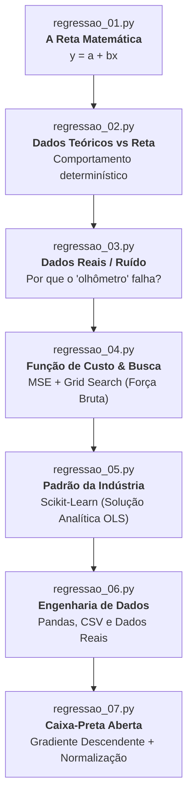
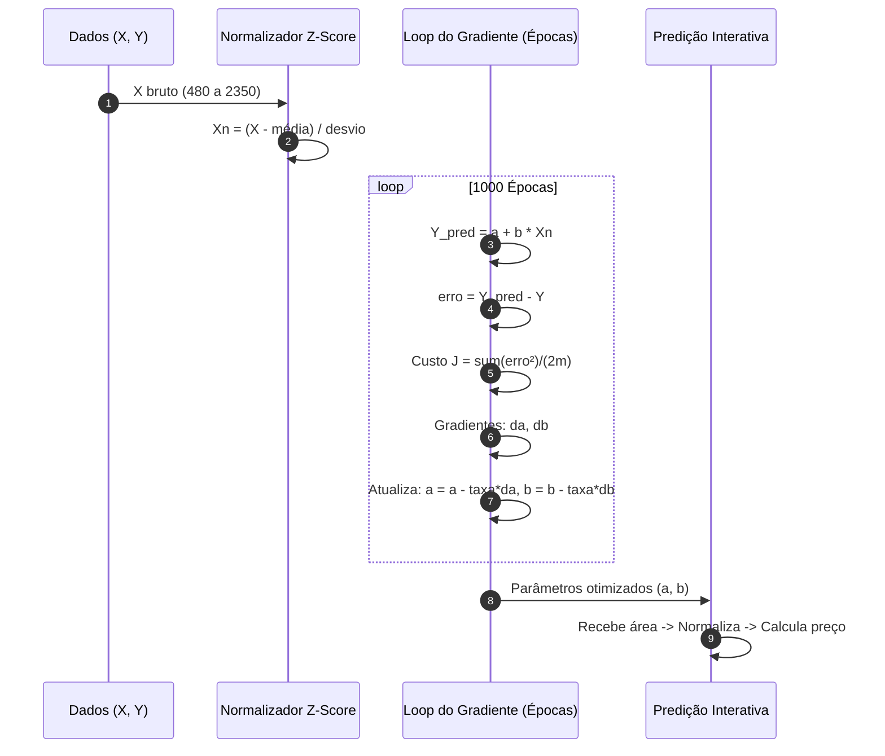

# Guia de Estudos e Depuração: Trilha de Regressão Linear

Este documento serve como guia completo de estudo, experimentação e depuração (*debugging*) para os códigos da pasta [`python_scripts/`](file:///Users/lucianosousa/local-documents/Luciano/Pós%20Graduação%20UFG/Disciplinas/AM/projeto-am/python_scripts).

---

## 🗺️ Mapa da Trilha de Aprendizagem

A sequência de scripts foi construída pedagogicamente para levar o estudante desde a intuição geométrica básica até o algoritmo fundamental que move grande parte da Inteligência Artificial moderna:



| Arquivo | Foco Principal | Abordagem | Complexidade |
| :--- | :--- | :--- | :--- |
| [`regressao_01.py`](file:///Users/lucianosousa/local-documents/Luciano/Pós%20Graduação%20UFG/Disciplinas/AM/projeto-am/python_scripts/regressao_01.py) | Geometria da Função Afim | Visualização estática | $\mathcal{O}(1)$ |
| [`regressao_02.py`](file:///Users/lucianosousa/local-documents/Luciano/Pós%20Graduação%20UFG/Disciplinas/AM/projeto-am/python_scripts/regressao_02.py) | Ajuste Perfeito aos Dados | Reta fixa com dispersão perfeitamente colinear | $\mathcal{O}(1)$ |
| [`regressao_03.py`](file:///Users/lucianosousa/local-documents/Luciano/Pós%20Graduação%20UFG/Disciplinas/AM/projeto-am/python_scripts/regressao_03.py) | Incerteza e Dados Não-Lineares | Ajuste manual vs. Coeficientes Analíticos | $\mathcal{O}(1)$ |
| [`regressao_04.py`](file:///Users/lucianosousa/local-documents/Luciano/Pós%20Graduação%20UFG/Disciplinas/AM/projeto-am/python_scripts/regressao_04.py) | Função de Perda (MSE) | Otimização por Força Bruta (*Grid Search*) | $\mathcal{O}(N_{a} \times N_{b} \times m)$ |
| [`regressao_05.py`](file:///Users/lucianosousa/local-documents/Luciano/Pós%20Graduação%20UFG/Disciplinas/AM/projeto-am/python_scripts/regressao_05.py) | Modelagem Profissional | Framework Scikit-Learn (*Ordinary Least Squares*) | $\mathcal{O}(m \cdot p^2)$ |
| [`regressao_06.py`](file:///Users/lucianosousa/local-documents/Luciano/Pós%20Graduação%20UFG/Disciplinas/AM/projeto-am/python_scripts/regressao_06.py) | Pipeline de Dados Reais | Limpeza com Pandas + Modelagem de Expectativa de Vida | $\mathcal{O}(m \cdot p^2)$ |
| [`regressao_07.py`](file:///Users/lucianosousa/local-documents/Luciano/Pós%20Graduação%20UFG/Disciplinas/AM/projeto-am/python_scripts/regressao_07.py) | Otimização Numérica | Gradiente Descendente (*Batch Gradient Descent*) | $\mathcal{O}(\text{épocas} \times m)$ |

---

## 1. [`regressao_01.py`](file:///Users/lucianosousa/local-documents/Luciano/Pós%20Graduação%20UFG/Disciplinas/AM/projeto-am/python_scripts/regressao_01.py): A Geometria da Reta

### 🎯 Objetivo & Conceito-Chave
Compreender a base matemática de qualquer modelo de regressão linear simples: a **função polinomial de 1º grau (função afim)**:
$$Y = a + b \cdot X$$
Onde:
- $a$ é o **intercepto linear** (ou *bias* / viés $w_0$): valor previsto de $Y$ quando $X = 0$.
- $b$ é o **coeficiente angular** (ou *peso* / *slope* $w_1$): a taxa de variação de $Y$ por unidade de $X$ (quanto o preço sobe para cada $m^2$).

### 🔍 Dissecção do Código
- `np.linspace(0, 1000, 1000)`: Gera um vetor de 1000 pontos linearmente espaçados no domínio $[0, 1000]$.
- `Y = a + b * X`: Operação vetorizada NumPy (muito mais rápida que loops `for` em Python puro).
- `plt.plot(X, Y, '-r')`: Plota a linha contínua vermelha.
- `plt.xlim()`, `plt.ylim()`, `plt.xticks()`: Customizam escala e marcações dos eixos.

### 💡 O que estamos aprendendo aqui
Antes de falar em *Machine Learning*, precisamos entender a ferramenta que usaremos para modelar a realidade. Um modelo linear faz uma **suposição forte** (*inductive bias*): assume que o fenômeno real pode ser aproximado por uma linha reta.

### 🧪 Como Estudar
1. Mude `a = 500`. Observe como a reta sobe em bloco sem mudar a inclinação.
2. Mude `b = -0.5`. Observe como a inclinação passa a ser decrescente (relação inversamente proporcional).
3. Mude `b = 0`. O que a reta horizontal representa? (Representa um modelo que sempre prevê a mesma constante independente de $X$).

### 🐞 Como Debugar
- **Erro comum**: Esquecer de rodar `plt.show()` ou tentar plotar vetores de tamanhos diferentes (`len(X) != len(Y)`).
- **Ponto de parada**: Coloque um breakpoint na linha 14:
  ```python
  breakpoint()
  ```
  No terminal do debugger, execute:
  ```text
  (Pdb) X.shape
  (1000,)
  (Pdb) Y.shape
  (1000,)
  (Pdb) Y[:5]
  array([0.        , 0.8008008 , 1.6016016 , 2.4024024 , 3.2032032 ])
  ```

---

## 2. [`regressao_02.py`](file:///Users/lucianosousa/local-documents/Luciano/Pós%20Graduação%20UFG/Disciplinas/AM/projeto-am/python_scripts/regressao_02.py): Confrontando a Reta com Dados Sintéticos

### 🎯 Objetivo & Conceito-Chave
Apresentar o conceito de **ajuste perfeito (ideal)**. Aqui os pontos $(X_{dados}, Y_{dados})$ foram construídos de maneira estritamente determinística a partir da relação:
$$\text{Preço} = 20 + 0.15 \cdot \text{Área}$$

### 🔍 Dissecção do Código
- `plt.plot(X_dados, Y_dados, 'o', color='black')`: Desenha os pontos observados como círculos pretos (diagrama de dispersão / *scatter plot*).
- Os parâmetros $a = 20$ e $b = 0.15$ são fornecidos diretamente.
- A reta vermelha passa exatamente sobre todos os círculos pretos.

### 💡 O que estamos aprendendo aqui
No mundo teórico ideal, os dados não têm ruído e um modelo perfeito possui erro zero. Em aprendizado de máquina, este cenário praticamente nunca existe no mundo real.

### 🧪 Como Estudar
1. Calcule na mão o primeiro ponto: para $X = 480$, $Y = 20 + 0.15 \times 480 = 20 + 72 = 92$. Verifique o primeiro elemento de `Y_dados`.
2. Adicione uma perturbação nos dados para simular o mundo real:
   ```python
   Y_dados = Y_dados + np.random.normal(0, 10, size=len(Y_dados))
   ```
   Rode novamente e veja como a reta fixa não mais acerta todos os pontos.

### 🐞 Como Debugar
- Verifique se os comprimentos de `X_dados` e `Y_dados` coincidem:
  ```python
  assert len(X_dados) == len(Y_dados), "Tamanho dos vetores deve ser idêntico!"
  ```

---

## 3. [`regressao_03.py`](file:///Users/lucianosousa/local-documents/Luciano/Pós%20Graduação%20UFG/Disciplinas/AM/projeto-am/python_scripts/regressao_03.py): O Desafio dos Dados Reais e o Ajuste Manual

### 🎯 Objetivo & Conceito-Chave
Exibir dados com **ruído estatístico** e ilustrar o problema fundamental da regressão: quando os pontos não estão perfeitamente alinhados, **qual é a melhor reta possível?**

### 🔍 Dissecção do Código
- `Y_dados = np.array([98, 110, 200, 210, 280, 265, 300, 287, 325, 300, 290])`: Veja que para $X = 1400$ temos $Y = 300$, e para $X = 1920$ temos $Y = 300$ novamente. Os dados flutuam.
- Os parâmetros utilizados:
  - $a \approx 120.24$
  - $b \approx 0.0991$
  Foram calculados analiticamente através do Método dos Mínimos Quadrados (*Ordinary Least Squares - OLS*).

### 💡 O que estamos aprendendo aqui
Ajustar parâmetros "no olho" não é escalável nem rigoroso. Precisamos de:
1. Uma **métrica matemática** para quantificar a qualidade do ajuste (o erro).
2. Um **método sistemático** para encontrar os parâmetros que minimizam esse erro.

### 🧪 Como Estudar
1. Comente as linhas com $a = 120.23986$ e $b = 0.09914044$ e tente "chutar" valores:
   ```python
   a = 100
   b = 0.12
   ```
2. Observe como pequenas mudanças em $b$ provocam rotações bruscas na reta para valores altos de $X$.

### 🐞 Como Debugar
- Inspecione a discrepância individual entre o ponto e a reta:
  ```python
  residuos = Y_dados - (a + b * X_dados)
  print("Resíduos:", residuos)
  ```
  Observe que alguns resíduos são positivos (o ponto está acima da reta) e outros são negativos (o ponto está abaixo da reta).

---

## 4. [`regressao_04.py`](file:///Users/lucianosousa/local-documents/Luciano/Pós%20Graduação%20UFG/Disciplinas/AM/projeto-am/python_scripts/regressao_04.py): Otimização por Força Bruta e a Função de Custo (MSE)

### 🎯 Objetivo & Conceito-Chave
Introduzir a **Função de Custo (Loss Function)** e a ideia de **treinamento por busca sistemática (*Grid Search*)**.
O **Erro Quadrático Médio (MSE - Mean Squared Error)**:
$$\text{MSE} = \frac{1}{m} \sum_{i=1}^{m} (y^{(i)} - \hat{y}^{(i)})^2$$
Onde $\hat{y}^{(i)} = a + b \cdot x^{(i)}$.

### 🔍 Dissecção do Código
1. **Ponto de partida heurístico**:
   - `b_estimado = (Y.max() - Y.min()) / (X.max() - X.min())`: Calcula a inclinação média entre os extremos.
   - `a_estimado = np.mean(Y_dados - b_estimado * X_dados)`: Garante que a reta passe pelo centroide $(\bar{X}, \bar{Y})$.
2. **Laço aninhado (Grid Search)**:
   - Testa variações de $a$ no intervalo $[a_{est} - 100, a_{est} + 100]$ com passo $1$.
   - Testa variações de $b$ no intervalo $[b_{est} - 0.10, b_{est} + 0.10]$ com passo $0.001$.
3. **Seleção do Mínimo Global da Grade**:
   - `if mse < menor_mse: menor_mse = mse; melhor_a = a; melhor_b = b`.

### 💡 O que estamos aprendendo aqui
Este é o primeiro script onde o **computador aprende por conta própria**:
- Definimos um espaço de busca de hipóteses.
- O algoritmo testa combinações e escolhe a que minimiza a perda.
- **Limitação crítica**: Força bruta não escala! Se tivéssemos 10 variáveis (em vez de apenas $X$), o número de combinações explodiria exponencialmente (maldição da dimensionalidade).

### 🧪 Como Estudar
1. Imprima a quantidade de combinações testadas:
   ```python
   n_a = len(np.arange(a_estimado - 100, a_estimado + 100, 1))
   n_b = len(np.arange(b_estimado - 0.10, b_estimado + 0.10, 0.001))
   print(f"Total de combinações avaliadas: {n_a * n_b:,}")
   ```
2. Reduza o passo de $b$ para `0.01` e compare o tempo de execução e a precisão do MSE encontrado.

### 🐞 Como Debugar
- **Onde colocar breakpoint**: No início do laço de busca ou logo após encontrar um novo menor MSE:
  ```python
  if mse < menor_mse:
      menor_mse = mse
      melhor_a = a
      melhor_b = b
      # breakpoint() # Descomente para ver cada melhoria sucessiva!
  ```
- No Pdb, avalie:
  ```text
  (Pdb) p a, b, mse
  ```

---

## 5. [`regressao_05.py`](file:///Users/lucianosousa/local-documents/Luciano/Pós%20Graduação%20UFG/Disciplinas/AM/projeto-am/python_scripts/regressao_05.py): O Padrão da Indústria com Scikit-Learn

### 🎯 Objetivo & Conceito-Chave
Substituir a busca manual ingênua pela implementação otimizada do **Scikit-Learn**, que resolve a equação normal fechada (solução analítica via Decomposição em Valores Singulares - SVD):
$$\boldsymbol{\theta} = (\mathbf{X}^T \mathbf{X})^{-1} \mathbf{X}^T \mathbf{y}$$

### 🔍 Dissecção do Código
- `X_dados.reshape(-1, 1)`: **Vital no Scikit-Learn!** O scikit espera uma matriz 2D onde as linhas são as amostras ($n$) e as colunas são as características (*features*, $p$). Um vetor 1D `(11,)` precisa virar `(11, 1)`.
- `modelo = LinearRegression()`: Instancia o estimador.
- `modelo.fit(X, Y_dados)`: Executa o ajuste analítico em milissegundos.
- `modelo.intercept_`: Retorna o valor escalar de $a$ ($w_0$).
- `modelo.coef_`: Retorna um array com os coeficientes $b$ ($w_1, w_2, \dots$).
- `modelo.predict(X)`: Realiza a inferência vetorizada $\hat{Y} = \mathbf{X}\mathbf{w} + w_0$.

### 💡 O que estamos aprendendo aqui
Entender a API unificada do Scikit-Learn:
```python
modelo = Estimador()
modelo.fit(X_treino, y_treino)
predicoes = modelo.predict(X_novos)
```
Essa interface é a mesma para Regressão Linear, Random Forest, SVM ou Redes Neurais.

### 🧪 Como Estudar
1. Compare os coeficientes obtidos aqui com os do [`regressao_04.py`](file:///Users/lucianosousa/local-documents/Luciano/Pós%20Graduação%20UFG/Disciplinas/AM/projeto-am/python_scripts/regressao_04.py):
   - Scikit-Learn: $a \approx 120.2399$, $b \approx 0.099140$, $\text{MSE} \approx 643.08$
   - Grid Search: $a \approx 120.40$, $b \approx 0.0990$, $\text{MSE} \approx 643.09$
   A solução analítica encontra o mínimo global exato sem precisar iterar.
2. Experimente calcular a métrica $R^2$ (coeficiente de determinação):
   ```python
   r2 = modelo.score(X, Y_dados)
   print(f"R² Score: {r2:.4f}")
   ```

### 🐞 Como Debugar
- **Erro clássico do Scikit-Learn**:
  ```text
  ValueError: Expected 2D array, got 1D array instead: array=[480 510 ...]. Reshape your data either using array.reshape(-1, 1) if your data has a single feature...
  ```
- Para debugar formato de matrizes:
  ```python
  print(f"X shape: {X.shape}, Y shape: {Y_dados.shape}")
  ```

---

## 6. [`regressao_06.py`](file:///Users/lucianosousa/local-documents/Luciano/Pós%20Graduação%20UFG/Disciplinas/AM/projeto-am/python_scripts/regressao_06.py): Pipeline Real com Pandas e CSV

### 🎯 Objetivo & Conceito-Chave
Aplicar Regressão Linear em um conjunto de dados do mundo real (Expectativa de Vida vs. Mortalidade Adulta da OMS) e dominar as etapas de **ingestão, limpeza e pré-processamento de dados tabular**.

### 🔍 Dissecção do Código
1. `pd.read_csv("regressao_06.csv")`: Carrega o arquivo tabular em um `DataFrame`.
2. `df.columns = df.columns.str.strip()`: Remove espaços em branco antes ou depois dos nomes das colunas (ex: `" Life expectancy "` vira `"Life expectancy"`). Essa é uma das causas mais frequentes de `KeyError` em Data Science!
3. `.dropna()`: Descarta linhas contendo valores nulos (`NaN`). Modelos matemáticos padrão não aceitam dados faltantes.
4. `X_linha = np.linspace(X_dados.min(), X_dados.max(), 300).reshape(-1, 1)`: Gera a linha de tendência dentro do intervalo real observado dos dados.

### 💡 O que estamos aprendendo aqui
Na prática, 80% do trabalho em Machine Learning envolve carregar, limpar e preparar os dados antes de executar o `fit()`.

### 🧪 Como Estudar
1. Abra o arquivo [`regressao_06.csv`](file:///Users/lucianosousa/local-documents/Luciano/Pós%20Graduação%20UFG/Disciplinas/AM/projeto-am/python_scripts/regressao_06.csv) e inspecione as colunas.
2. Inverta os papéis das variáveis para ver a relação oposta:
   - $X$ = Adult Mortality
   - $Y$ = Life expectancy
   Como a inclinação da reta se comporta?
3. Adicione uma verificação exploratória antes do modelo:
   ```python
   print(df.info())
   print(df.describe())
   ```

### 🐞 Como Debugar
- **Problema de caminho de arquivo (`FileNotFoundError`)**: Se você rodar o script a partir de outra pasta, `pd.read_csv("regressao_06.csv")` pode falhar.
  *Correção robusta*:
  ```python
  import pathlib
  pasta_atual = pathlib.Path(__file__).parent.resolve()
  df = pd.read_csv(pasta_atual / "regressao_06.csv")
  ```
- Inspecione valores ausentes no terminal do debugger:
  ```python
  breakpoint()
  # No terminal:
  df.isnull().sum()
  ```

---

## 7. [`regressao_07.py`](file:///Users/lucianosousa/local-documents/Luciano/Pós%20Graduação%20UFG/Disciplinas/AM/projeto-am/python_scripts/regressao_07.py): Abertura da Caixa-Preta — Gradiente Descendente

### 🎯 Objetivo & Conceito-Chave
Desmistificar o algoritmo de otimização mais importante da Inteligência Artificial: o **Gradiente Descendente em Lote (*Batch Gradient Descent*)**.

Em vez de testar combinações aleatórias (como no [`regressao_04.py`](file:///Users/lucianosousa/local-documents/Luciano/Pós%20Graduação%20UFG/Disciplinas/AM/projeto-am/python_scripts/regressao_04.py)) ou calcular matrizes inversas pesadas (como no OLS do [`regressao_05.py`](file:///Users/lucianosousa/local-documents/Luciano/Pós%20Graduação%20UFG/Disciplinas/AM/projeto-am/python_scripts/regressao_05.py)), o algoritmo **"desce a montanha"** do erro usando derivadas:

$$J(a, b) = \frac{1}{2m} \sum_{i=1}^{m} (y^{(i)}_{pred} - y^{(i)})^2$$

Gradientes parciais:
$$\frac{\partial J}{\partial a} = \frac{1}{m} \sum_{i=1}^{m} (y^{(i)}_{pred} - y^{(i)})$$
$$\frac{\partial J}{\partial b} = \frac{1}{m} \sum_{i=1}^{m} (y^{(i)}_{pred} - y^{(i)}) \cdot X^{(i)}_n$$

Atualização dos pesos a cada época:
$$a \leftarrow a - \alpha \cdot \frac{\partial J}{\partial a}$$
$$b \leftarrow b - \alpha \cdot \frac{\partial J}{\partial b}$$
onde $\alpha$ é a **taxa de aprendizagem (*learning rate*)**.

### 🔍 Dissecção do Código



1. **Normalização por Z-Score (`Xn = (X - media) / desvio`)**:
   - Sem normalização, a escala de $X$ vai até $2350$ enquanto a de $Y$ vai até $370$. Isso cria uma superfície de custo elíptica e estreita ("ravina"), onde o gradiente oscila descontroladamente ou precisa de um $\alpha$ minúsculo ($10^{-7}$).
   - Com normalização, as curvas de nível do erro tornam-se circulares e o gradiente aponta diretamente para o centro (convergência rápida e estável).
2. **Histórico de Custo (`historico_custo.append(J)`)**:
   - Permite plotar a curva de aprendizado para certificar que o erro diminui monotonicamente.
3. **Módulo Interativo Final**:
   - Recebe a entrada do usuário em $m^2$, aplica a **mesma transformação de normalização** usada no treino e devolve o preço estimado em Reais.

### 💡 O que estamos aprendendo aqui
- Como as redes neurais e modelos de deep learning aprendem (todos usam variantes do Gradiente Descendente: SGD, Adam, RMSprop).
- A importância vital do pré-processamento de escala de variáveis numéricas (*Feature Scaling*).
- O significado do gráfico de convergência da função de custo $J$ versus épocas.

### 🧪 Como Estudar
1. **O que acontece se mudarmos a taxa de aprendizagem (`taxa`)?**
   - Experimente `taxa = 0.5`: a convergência ocorre em muito menos épocas.
   - Experimente `taxa = 2.5`: observe a divergência! O custo explode para o infinito (`nan` / *exploding gradient*).
   - Experimente `taxa = 0.0001`: o modelo não consegue convergir em 1000 épocas (*underfitting* por passos pequenos demais).
2. **O que acontece sem normalização?**
   - Troque `Xn = (X - media) / desvio` por `Xn = X`.
   - Mantenha `taxa = 0.05` e rode o script. Veja o que acontece com os valores de $a$ e $b$! (Eles se tornam `inf` ou `nan`).

### 🐞 Como Debugar o Gradiente Descendente
O Gradiente Descendente é notório por bugs silenciosos. Aqui está o checklist de depuração:

1. **Checagem do Custo Monotônico**:
   A cada época, $J$ **deve diminuir**. Se $J$ aumentar ou oscilar, há três causas possíveis:
   - Taxa de aprendizagem $\alpha$ está alta demais.
   - Sinal da derivada invertido (usou $+$ em vez de $-$ na atualização).
   - Dados não normalizados.
2. **Inserção de Breakpoint para Inspeção**:
   ```python
   # Coloque dentro do loop na época 0 e na época 500:
   if epoca in [0, 500]:
       breakpoint()
   ```
   Comandos úteis no debugger:
   ```text
   (Pdb) p J              # Custo atual
   (Pdb) p da, db         # Tamanho dos passos do gradiente
   (Pdb) p a, b           # Valores correntes dos parâmetros
   ```

---

## 🛠️ Guia Prático de Debugging em Python & Ciência de Dados

### 1. Usando o Debugger Nativo do Python (`breakpoint()`)
A partir do Python 3.7, basta inserir a função `breakpoint()` em qualquer linha do seu script:
```python
# Exemplo em regressao_07.py:
da = np.sum(erro) / m
db = np.sum(erro * Xn) / m
breakpoint()  # <-- O programa pausa aqui!
```
Quando o código parar no terminal, você tem um interpretador interativo completo:
- `n` (*next*): Executa a próxima linha.
- `s` (*step into*): Entra dentro da função chamada.
- `c` (*continue*): Continua a execução normal até o próximo breakpoint.
- `p <variavel>`: Imprime o valor da variável.
- `q` (*quit*): Aborta a execução.

### 2. Debugging Visual no VS Code / Antigravity IDE
1. Abra qualquer arquivo `.py` da pasta `python_scripts/`.
2. Clique na margem esquerda, ao lado do número da linha, para criar um **ponto vermelho (breakpoint)**.
3. Pressione **F5** (ou vá em *Run and Debug* -> *Python Debugger: Debug Current File*).
4. O painel lateral mostrará:
   - **Variables**: Valores de todas as variáveis locais e globais em tempo real.
   - **Watch**: Expressões personalizadas para monitorar (ex: `modelo.coef_[0]`, `X.shape`).
   - **Call Stack**: Pilha de chamadas ativas.

### 3. As 4 Armadilhas Mais Comuns em Regressão Linear

| Sintoma / Erro | Causa Mais Provável | Como Resolver |
| :--- | :--- | :--- |
| `ValueError: Expected 2D array, got 1D array` | Passou vetor 1D para o Scikit-Learn | Use `X.reshape(-1, 1)` |
| `RuntimeWarning: overflow encountered` | Gradiente Descendente divergindo | Reduza a `taxa` (learning rate) ou normalize $X$ |
| Coeficiente $b$ com sinal oposto ao esperado | Variáveis correlacionadas inversamente ou erro na fórmula dos resíduos | Inspecione o scatter plot $X \times Y$ |
| Gráfico não aparece | Faltou chamar `plt.show()` ou o backend está em modo `agg` | Certifique-se de executar em ambiente com display ou salve com `plt.savefig("grafico.png")` |

---

## 🎓 Conclusão e Próximos Passos Sugeridos

Com estes 7 scripts você compreendeu:
1. A representação geométrica dos modelos lineares.
2. A formalização matemática do erro através do MSE.
3. A diferença entre **soluções analíticas exatas** e **métodos iterativos de otimização**.
4. Como utilizar ferramentas de padrão industrial (`numpy`, `pandas`, `matplotlib`, `scikit-learn`).

**Sugestão de Próximos Passos:**
- **Regressão Múltipla**: Estender o modelo para prever preços usando mais variáveis (ex: Área, Quantidade de Quartos, Vagas de Garagem).
- **Regularização**: Implementar penalidades **Ridge (L2)** e **Lasso (L1)** para evitar *overfitting*.
- **Classificação**: Adaptar a regressão linear com a função Sigmoide para criar a **Regressão Logística**.
