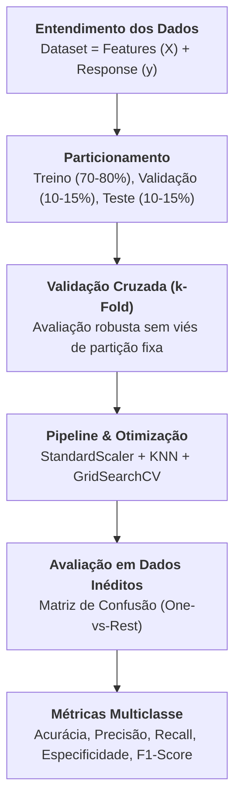
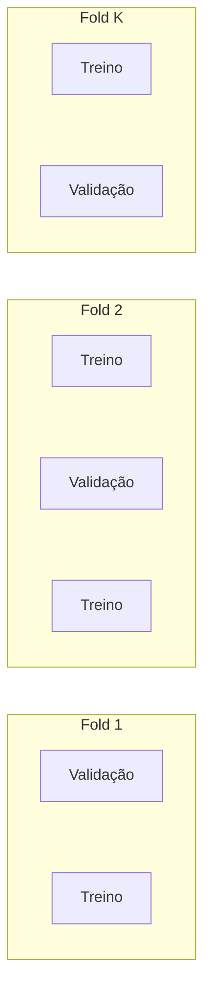

# Guia de Estudos: Aprendizado Supervisionado, Classificação e Métricas de Avaliação

Este documento serve como guia de estudo teórico e prático para o módulo de **Aprendizado Supervisionado** com foco em **Classificação**, **Scikit-Learn** e **Métricas de Avaliação**, baseado nas aulas do Prof. Dr. Ronaldo Martins da Costa (UFG / INF).

---

## 🗺️ Visão Geral da Trilha



---

## 1. O que é o Scikit-Learn?

O **Scikit-Learn** (`sklearn`) é a biblioteca padrão da indústria em Python para aprendizado de máquina clássico e modelagem estatística.
- **2007**: Criado como projeto do Google Summer of Code por David Cournapeau.
- **2008–2009**: Gaël Varoquaux e equipe lideraram a reescrita e expansão do projeto.
- **2010**: Lançamento oficial público.

O Scikit-Learn organiza suas funcionalidades em quatro grandes pilares:
1. **Classificação**: Identificar a qual categoria um objeto pertence (ex: Spam vs. Não-Spam, espécie de flor).
2. **Regressão**: Prever um atributo contínuo associado a um objeto (ex: Preço de casa, demanda de energia).
3. **Agrupamento (Clustering)**: Agrupamento automático de objetos similares sem rótulos prévios (ex: Segmentação de clientes).
4. **Redução de Dimensionalidade**: Reduzir o número de variáveis aleatórias a considerar (ex: PCA, t-SNE).

---

## 2. Aprendizado Supervisionado: Conceitos Básicos

No aprendizado supervisionado, o algoritmo aprende a partir de exemplos rotulados:

$$\text{Saída } (y) = f(\text{Entradas } X)$$

### 2.1. O Conjunto $X$ (Features / Características)
Também conhecido como:
- **Preditores**
- **Entradas** (*Inputs*)
- **Atributos**

São as medidas ou observações conhecidas sobre cada indivíduo ou amostra (ex: peso, altura, cor dos olhos, idade, renda).

### 2.2. O Conjunto $y$ (Response / Resposta)
Também conhecido como:
- **Destino** (*Target*)
- **Rótulo** (*Label*)
- **Saída** (*Output*)

É o valor real que queremos prever (ex: Albert Einstein / Princesa Diana / Muhammad Ali; ou se o cliente Comprou / Não Comprou).

---

## 3. Generalização vs. Memorização (Overfitting)

> [!IMPORTANT]
> **A Analogia da Prova Escolar:**
> Utilizar todos os dados disponíveis para treinar e testar um modelo seria equivalente a fornecer aos alunos uma lista contendo exatamente as questões que cairão na prova e, depois, aplicar essa mesma prova para dar a nota. Estaríamos medindo a capacidade de **memorização**, não o **aprendizado real**.

Em Machine Learning, o objetivo supremo é a **capacidade de generalização**: o modelo deve aprender padrões gerais no conjunto de treinamento e ser capaz de realizar previsões corretas em dados **novos e nunca antes vistos**.

---

## 4. Estratégia de Divisão dos Dados: Treino, Validação e Teste

Para garantir avaliação fidedigna e evitar o vazamento de informações (*data leakage*), dividimos os dados em 3 conjuntos:

```text
┌─────────────────────────────────────────────────────────────────────────┐
│                           DATASET COMPLETO                              │
├─────────────────────────────────────┬─────────────────┬─────────────────┤
│            TREINAMENTO              │    VALIDAÇÃO    │      TESTE      │
│             (70% a 80%)             │   (10% a 15%)   │   (10% a 15%)   │
├─────────────────────────────────────┼─────────────────┼─────────────────┤
│       "Material de Estudo"          │ "Exercícios de  │     "Prova      │
│  Ensinar o modelo a extrair padrões │   Preparação"   │     Final"      │
│         e ajustar pesos             │ Ajustar hiper-  │ Avaliar a real  │
│                                     │   parâmetros    │ generalização   │
└─────────────────────────────────────┴─────────────────┴─────────────────┘
```

### 4.1. Parâmetros Críticos do `train_test_split`

No Scikit-Learn, a divisão é feita com a função:
```python
X_train, X_test, y_train, y_test = train_test_split(
    X, 
    y, 
    test_size=0.15, 
    random_state=42, 
    stratify=y
)
```

1. **`test_size=0.15`**: Reserva 15% das amostras exclusivamente para o teste final.
2. **`random_state=42`**:
   - Controla o gerador pseudoaleatório de embaralhamento (*seed*).
   - Garante a **reprodutibilidade**: se outra pessoa ou script rodar o código, a divisão das amostras será rigorosamente idêntica.
   - **Por que o 42?** É uma célebre homenagem à clássica obra *"O Guia do Mochileiro das Galáxias"* de Douglas Adams, onde 42 é "a resposta para o sentido da vida, o universo e tudo mais". Poderia ser qualquer outro número inteiro.
3. **`stratify=y`**:
   - Realiza uma **divisão estratificada**.
   - Garante que os subconjuntos de treino e teste mantenham a **mesma proporção de classes** existente no dataset original.
   - **Por que é perigoso omitir `stratify`?** Em uma amostragem aleatória comum, classes minoritárias poderiam ficar com 0 amostras no conjunto de teste, impossibilitando a avaliação do modelo para aquela categoria!

---

## 5. Validação Cruzada (*k-Fold Cross Validation*) e `GridSearchCV`

Em vez de fixar um percentual estático para validação, a **Validação Cruzada em $K$ Partições ($k$-Fold)** particiona os dados de treino em $K$ blocos de tamanho igual:

- O processo executa $K$ iterações.
- Em cada iteração, $K-1$ blocos são usados para treinar e o bloco restante é usado para validar.
- Ao final, calcula-se a média das métricas (Acurácia, F1, etc.), fornecendo uma estimativa muito mais estável da capacidade de generalização.



### 5.1. Construção de Pipeline
Ao buscar parâmetros com validação cruzada, não podemos normalizar os dados antes da divisão, pois as médias e desvios do conjunto de validação "vazariam" para o treino (*data leakage*). O `Pipeline` resolve isso encapsulando os passos:

```python
pipeline = Pipeline([
    ("scaler", StandardScaler()),
    ("knn", KNeighborsClassifier())
])
```

### 5.2. Busca em Grade com `GridSearchCV`
O `GridSearchCV` testa exaustivamente todas as combinações do dicionário de parâmetros:
```python
parametros = {
    "knn__n_neighbors": range(1, 8),
    "knn__weights": ["uniform", "distance"],
    "knn__metric": ["euclidean", "manhattan"],
    "knn__algorithm": ["auto", "ball_tree", "kd_tree"]
}

grid = GridSearchCV(
    estimator=pipeline,
    param_grid=parametros,
    cv=10,
    scoring="accuracy",
    n_jobs=-1,
    return_train_score=True
)
grid.fit(X_train, y_train)
```

---

## 6. Avaliação de Modelos de Classificação

Para entender o comportamento do modelo, a métrica mais intuitiva é a **Matriz de Confusão**.

### 6.1. A Matriz de Confusão Multiclasse
Considere o exemplo fictício dos slides da UFG (Slide 32):

| Classe Predita \ Classe Real | Setosa | Virgínica | Versicolor | Total Predito |
| :--- | :---: | :---: | :---: | :---: |
| **Setosa** | **7** *(DP)* | 1 *(FD)* | 2 *(FD)* | 10 |
| **Virgínica** | 3 *(FD)* | **8** *(DP)* | 4 *(FD)* | 15 |
| **Versicolor** | 5 *(FD)* | 9 *(FD)* | **6** *(DP)* | 20 |
| **Total Real** | **15** | **20** | **12** | **45** |

- **Diagonal Principal (DP)**: Acertos do modelo (elementos classificados corretamente: 7 + 8 + 6 = 21).
- **Fora da Diagonal (FD)**: Erros de classificação e confusões entre classes.

---

### 6.2. Decomposição *One-vs-Rest* (Um contra Todos)

Em problemas com mais de 2 classes, decompõe-se a matriz focando em uma classe de cada vez: **Classe Analisada (Positiva)** versus **Todas as outras (Negativa)**.

Tomando a classe **Setosa** como exemplo:
- **Verdadeiro Positivo (VP)**: Era Setosa e o modelo previu Setosa:
  $$\mathbf{VP = 7}$$
- **Falso Positivo (FP - Erro Tipo I)**: O modelo previu Setosa, mas na verdade era Virgínica ou Versicolor:
  $$\mathbf{FP = 1 + 2 = 3}$$
- **Falso Negativo (FN - Erro Tipo II)**: Era Setosa, mas o modelo previu Virgínica ou Versicolor:
  $$\mathbf{FN = 3 + 5 = 8}$$
- **Verdadeiro Negativo (VN)**: Não era Setosa e o modelo não previu Setosa:
  $$\mathbf{VN = 8 + 9 + 4 + 6 = 27}$$

Verificação: $\text{Total} = VP + FP + FN + VN = 7 + 3 + 8 + 27 = 45$.

---

## 7. As Métricas Fundamentais de Avaliação

### 7.1. Precisão (*Precision*)
Mede a **confiabilidade das previsões positivas**: dentre todas as vezes que o modelo disse "é desta classe", quantas vezes ele acertou?

$$\text{Precision} = \frac{VP}{VP + FP}$$

- **Exemplo para Setosa**: $\frac{7}{7 + 3} = \frac{7}{10} = \mathbf{70{,}00\%}$.
- **Quando é a métrica mais importante?**
  - Quando os **Falsos Positivos são muito caros ou danosos**.
  - *Exemplos*: Classificador de Spam (não queremos que um e-mail de trabalho legítimo vá para o lixo), recomendação de medicamentos com efeitos colaterais severos, aprovação automática de empréstimos vultosos.

---

### 7.2. Recall (*Sensibilidade / Revocação / True Positive Rate*)
Mede a **capacidade de encontrar os exemplos reais**: dentre todos os indivíduos que realmente pertencem à classe, quantos o modelo conseguiu resgatar?

$$\text{Recall} = \frac{VP}{VP + FN}$$

- **Exemplo para Setosa**: $\frac{7}{7 + 8} = \frac{7}{15} = \mathbf{46{,}66\%}$.
- **Exemplo para Virgínica**: $\frac{8}{8 + 1 + 9} = \frac{8}{20} = \mathbf{44{,}44\%}$.
- **Exemplo para Versicolor**: $\frac{6}{6 + 4 + 2} = \frac{6}{12} = \mathbf{50{,}00\%}$.
- **Quando é a métrica mais importante?**
  - Quando os **Falsos Negativos têm consequências gravíssimas**.
  - *Exemplos*: Diagnóstico de câncer ou doenças fatais (deixar um paciente doente ir para casa sem tratamento é trágico), detecção de fraudes financeiras críticas, detecção de falha mecânica em turbinas de avião.

---

### 7.3. Especificidade (*Specificity / True Negative Rate*)
Mede a capacidade do modelo de **rejeitar corretamente os exemplos negativos**: dentre todas as amostras que NÃO pertencem à classe, quantas foram identificadas como negativas?

$$\text{Especificidade} = \frac{VN}{VN + FP}$$

- **Exemplo para Setosa**: $\frac{27}{27 + 3} = \frac{27}{30} = \mathbf{90{,}00\%}$.
- *Significado*: De todas as flores que não eram Setosa, o classificador acertou 90% ao dizer que não eram Setosa.

---

### 7.4. Acurácia (*Accuracy*)
Proporção de acertos globais em relação ao total de previsões:

$$\text{Acurácia} = \frac{\text{Acertos Totais}}{\text{Total de Amostras}} = \frac{VP + VN}{VP + VN + FP + FN}$$

- **Na abordagem One-vs-Rest (Setosa)**: $\frac{7 + 27}{45} = \mathbf{75{,}55\%}$.
- **Acurácia Global do Teste (Slide 31)**: $\frac{7 + 8 + 6}{38} = \frac{21}{38} = \mathbf{55{,}26\%}$.
- **A Armadilha da Acurácia:** Se 99% das amostras forem de classe negativa (ex: fraude em cartão), um modelo burro que sempre prevê "não é fraude" terá 99% de acurácia, mas 0% de Recall para a classe de interesse! Por isso, a acurácia é desaconselhada em datasets desbalanceados.

---

### 7.5. F1-Score (Média Harmônica)
O **F1-Score** combina a Precisão e o Recall em um único indicador através da média harmônica:

$$F_1 = 2 \times \frac{\text{Precision} \times \text{Recall}}{\text{Precision} + \text{Recall}}$$

- **Por que média harmônica e não aritmética?** A média harmônica penaliza fortemente valores extremos. Se um modelo tiver Precision = 100%, mas Recall = 0%, sua média aritmética seria 50%, mas seu F1 será 0!
- **Exemplo para Setosa**:
  $$F_1 = 2 \times \frac{70{,}00 \times 46{,}66}{70{,}00 + 46{,}66} = \mathbf{55{,}99\%}$$

---

## 8. Estratégias de Agregação Multiclasse: Macro, Weighted e Micro

Em problemas com 3 ou mais classes, como resumir a Precisão, o Recall e o F1 em um único número?

| Tipo | Como é calculado | Quando utilizar |
| :--- | :--- | :--- |
| **Por Classe** | Métrica calculada individualmente para cada classe. | Essencial para identificar pontos fracos do classificador em categorias específicas. |
| **Macro** | Média aritmética simples das métricas das classes: $\frac{1}{N}\sum M_i$. | Todas as classes têm a mesma importância, mesmo que desbalanceadas (ex: doenças raras). |
| **Weighted** | Média ponderada pela quantidade de amostras reais (*suporte*): $\sum (w_i \cdot M_i)$. | A distribuição populacional real das classes deve ser preservada. |
| **Micro** | Agrupa globalmente a soma de todos os VP, FP e FN antes de calcular. | Foco no desempenho global agregado (em multiclasse de rótulo único equivale à acurácia). |

### 8.1. Matriz de Tomada de Decisão

| Cenário de Negócio / Problema | Métrica Recomendada |
| :--- | :--- |
| Classes equilibradas | **Macro** ou **Micro** |
| Classes desbalanceadas | **Macro** |
| Classe rara é a mais crítica (ex: fraude, doença rara) | **Macro** + análise detalhada **Por Classe** |
| Desejo refletir a frequência natural da população | **Weighted** |
| Desejo medir apenas acertos brutos do sistema | **Micro** |
| Falsos positivos geram custos enormes | Foco em **Precision** (alta confiabilidade) |
| Falsos negativos geram riscos graves à vida ou segurança | Foco em **Recall** (alta sensibilidade) |
| Necessidade de equilíbrio entre falsos alarmes e omissões | Foco em **F1-Score** |

---

## 9. Roteiro de Depuração e Estudos com Python

Para acompanhar o treinamento e entender os objetos internos do Scikit-Learn:

1. **Abra o arquivo [`python_scripts/supervisionado_01.py`](file:///Users/lucianosousa/local-documents/Luciano/Pós%20Graduação%20UFG/Disciplinas/AM/projeto-am/python_scripts/supervisionado_01.py)** e insira um ponto de parada após o ajuste do grid:
   ```python
   breakpoint()
   ```
2. **Execute no terminal**:
   ```bash
   uv run python_scripts/supervisionado_01.py
   ```
3. **Comandos úteis no depurador (Pdb)**:
   ```text
   (Pdb) grid.best_params_
   {'knn__algorithm': 'auto', 'knn__metric': 'euclidean', 'knn__n_neighbors': 5, 'knn__weights': 'uniform'}
   (Pdb) grid.best_score_
   0.9685897435897436
   (Pdb) pd.DataFrame(grid.cv_results_)[['params', 'mean_test_score', 'rank_test_score']].sort_values('rank_test_score').head()
   ```

Para conferir todos os cálculos manuais da aula passo a passo:
```bash
uv run python_scripts/supervisionado_02_metricas_ficticias.py
```
